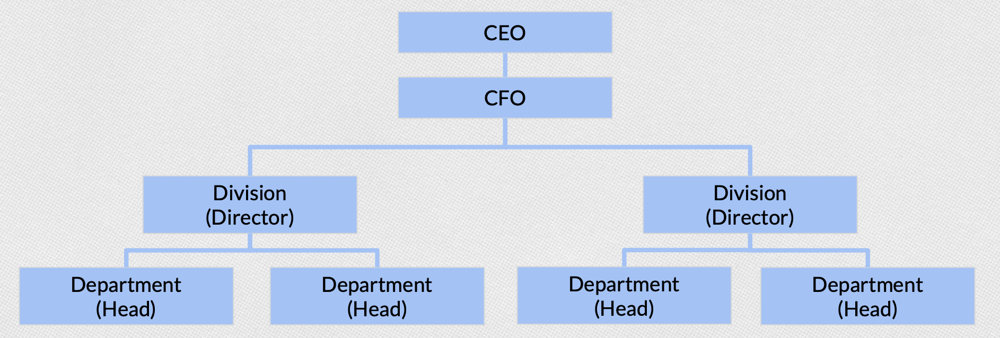
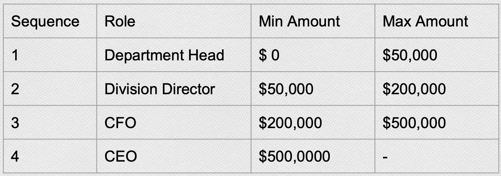
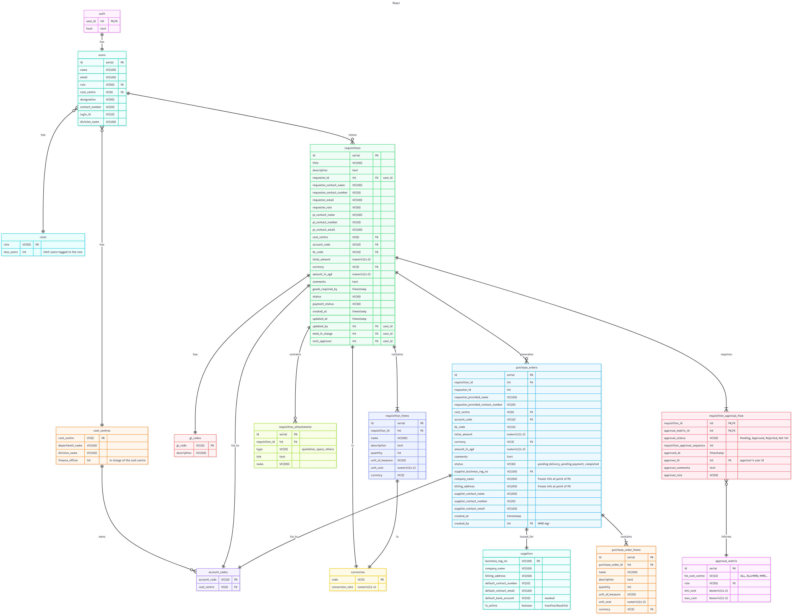
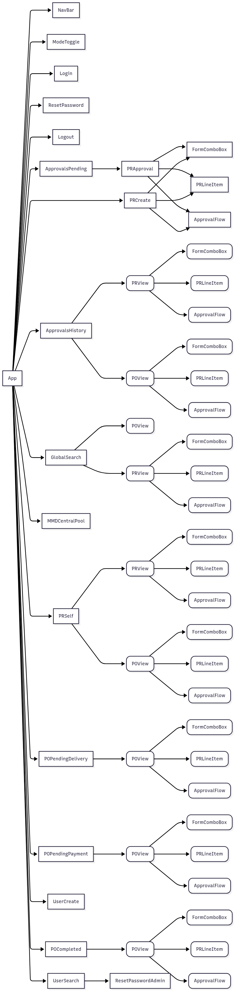

# Requi

**Requi** is a full-stack requisition and procurement management system designed to streamline the purchasing workflow in organisations.  
It supports requisition creation, multi-level approvals, document management, delivery and payment tracking — all with secure access controls.

---

## Key Features

- **Authentication & Authorization**

  - Secure login with JWT
  - Role-based access (staff, approvers, finance, procurements, system administrator)

- **Requisition Workflow**

  - Create and track requisitions
  - Automated approval flow based on the company's financial and procurement policies

- **Document Management**

  - Upload and manage supporting files
  - Integration with **Amazon S3** for scalable storage
  - Automatic unique file naming to prevent overwrites

- **Database Integration**

  - PostgreSQL with normalised schema for requisitions, suppliers, users, and purchase orders

- **Frontend Experience**
  - React-based UI with real-time form validation and file uploads
  - Role-specific dashboards and views

---

## Technical Stack

**Core Framework**: React, Flask (Python), PostgreSQL

**Others**:

- **Frontend:** React Hook Form, Zod, TailwindCSS, Tanstack Query, ShadCN UI
- **Backend:** Boto3, Google API Python Client / Google OAuth2, Flask-JWT-Extended, Bcrypt
- **Database:** PostgreSQL
- **File Storage:** Amazon S3 (Boto3)

---

## Project Setup

### Prerequisites

- Python 3.11+
- Node.js & npm
- PostgreSQL
- AWS credentials (for S3 integration)

### Installation

1. Clone the repository

2. Backend Setup

- Install the dependencies
- Create the `.env` file

  ```
  DATABASE_URL=your_database_url
  SECRET_KEY=your_secret_key
  JWT_SECRET_KEY=your_jwt_secret
  AWS_ACCESS_KEY_ID=your_key
  AWS_SECRET_ACCESS_KEY=your_secret
  S3_BUCKET_NAME=your_bucket_name


  DB_HOST=your_database_host
  DB_PORT=your_database_port
  DB=your_database_name
  DB_USER=your_database_user
  DB_PASSWORD=your_database_user_password
  JWT_SECRET_KEY=your_JWT_secret

  GOOGLE_REFRESH_TOKEN=your_gmail_api_refresh_token
  GOOGLE_CLIENT_ID=your_google_client_id
  GOOGLE_CLIENT_SECRET=your_google_client_secret
  SENDER_EMAIL=your_gmail_address

  AWS_ACCESS_KEY_ID=your_aws_access_id
  AWS_SECRET_ACCESS_KEY=your_aws_secret_access_key
  AWS_REGION=your_aws_s3_region
  AWS_S3_BUCKET=your_aws_bucket_name

  ```

3. Front-end Setup

- Create the `.env` file
  ```
  VITE-SERVER=your_server_url
  ```
- Install the dependencies

---

## Example Workflow

1. Staff

- Log in with a registered user account.
- Submit a requisition with required details and attachments (e.g. specs / quotations).
- Approval flow will be triggered automatically, and email notification (via Gmail API) will be sent to the next level approver.

2. Finance

- Receives an email notification to check the finance details (e.g. cost centre, account code, GL code) and approve the requisition.

3. Department Head / Directors / Senior Management

- Receives an email notification when the requisition reached their level for approval.

4. MMD and MMD Management - Approval of Requisition

- Executes the sourcing of supplier and PO generation.
- Edit the final list of line items for procurement
- Upload any attachments (e.g. specifications, goods info, quotation, PO)
- Requisition will flow to MMD Management for approval of the supplier and final PO.
- Once the PO is approved, MMD can inform the supplier for goods delivery.

5. MMD - Delivery of Goods

- Upload invoices, delivery notes and goods received notes for verification of goods received.

5. Finance

- With confirmation of goods received from MMD, Finance can initiated payment and upload the proof of payment to the system to close the requisition.

---

## Future Roadmap (if there's an opportunity)

- Automated generation of Purchase Order upon requisition approval
- Robust Audit Trails for compliance with finance/procurement policies
- Supplier management and tender management to track suppliers and automate sourcing of suppliers for requisitions
- Delivery and order management (e.g. to tally deliveries with requisitions)
- Invoices and payment management: opportunity to expand into a simple payment management or to link up with the Finance system
- Reports & Analytics e.g. Spend Analysis, Supplier Performance, Budget Compliance

---

## App Development

### App Features and Business Logic

I hope to develop an enterprise app that can manage the key procurement workflow of a company with different roles, i.e.:

- Create requisition
- Approve requisition
- Select supplier
- Create a PO
- Send PO to supplier
- Initiate Goods Received Note
- Perform 3-way matching
- Send to accounts payable

Since this demo is not customised for a specific company, I had to scope the business logic, organisation structure and procurement policies based on my past experience.

**Company Structure**


**Approval Matrix**


### Database Model

While designing the database, I aimed to achieve a good degree of normalization to ensure data integrity, reduce redundancy and most importantly, allow future scalability for this app.



### Front-End

Based on the features and business, I planned out the different pages of the app and the respective functions for different user roles. This is the component tree for Requi -



The front-end is quite challenging to build due to the different views based on (1) user roles and (2) requisition status. For instance,

- During the requisition approval stage, Finance can only edit the finance form fields and MMD can only edit the MMD form fields. These fields should not appear until the requisition reached their level. Other approvers (such as Director) are not allowed to edit the requisition. Non-MMD personnel are not allowed to see the MMD fields until the PO is approved.
- After the requisition is approved, only MMD should see the fields to upload delivery notes, invoices and goods received notes for the PO. The PO needs to be routed to Finance after this is done and Finance should see a section where they can upload proof of payment.
- For separation of scope, requester and the other staff can only see the requisition/PO and the status: they will not be able to see the MMD and Finance sections.
